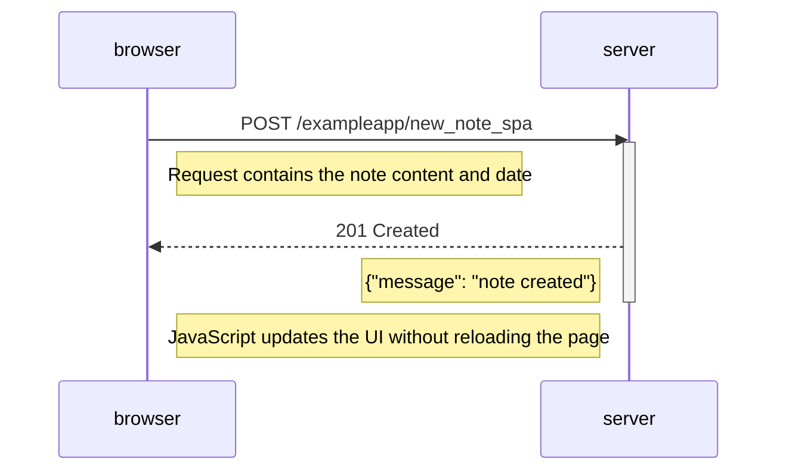

```mermaid
sequenceDiagram
    participant browser
    participant server

    browser->>server: POST /exampleapp/new_note_spa
    activate server
    Note right of browser: Request contains the note content and date
    server-->>browser: 201 Created
    Note left of server: {"message": "note created"}
    deactivate server

    Note right of browser: JavaScript updates the UI without reloading the page
```
